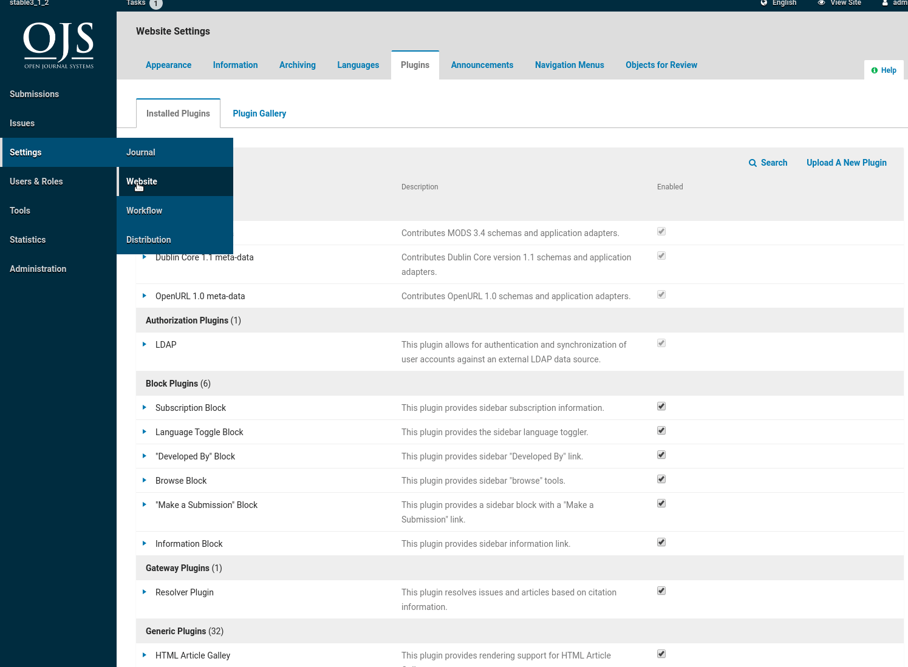

# OJS Typeset plugin
### Description

Allows integration of a command line tool to execute file conversion  to XML in OJS.

Currently supported:  
* Tools : [meTypeset](https://github.com/MartinPaulEve/meTypeset)
* Formtats: DOCX/ODT -> JATS XML

For other command line tool integrations,  minor code is needed.  

### Requirements
* OJS 3.1.2 or later
* [meTypeset](https://github.com/MartinPaulEve/meTypeset) 


### Installation 

```bash
OJS_PATH=DEFINE_YOUR_OJS_PATH
cd $OJS_PATH/plugins/generic
git clone https://github.com/withanage/typeset 

```

### Settings


### Run conversion


### Contact

https://github.com/withanage/typeset/issues


